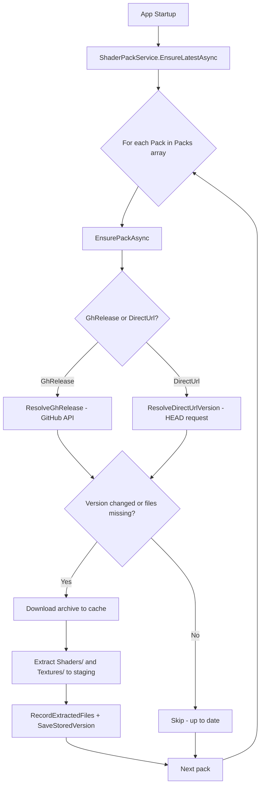

# Design Document: ReShade Installer Shader Packs

## Overview

This feature adds all 42 shader pack repositories offered by the official ReShade installer to the existing `ShaderPackService.Packs` array. Of these 42, 6 already exist in RDXC under different Ids, plus RDXC has 1 additional pack (`ClshortfuseShaders`) not in the ReShade installer. The net result is 36 new `ShaderPack` entries appended to the array, bringing the total from 7 to 43.

The change is primarily data-driven: new `ShaderPack` record entries are appended to the hardcoded array. No new classes, interfaces, or architectural changes are required — the existing download, extract, version-tracking, deployment, Select mode, and file-tracking infrastructure handles everything.

### Key Design Decisions

1. All new packs use `IsMinimum = false`, preserving the existing behaviour where only Lilium HDR Shaders is deployed in Minimum mode. The ReShade installer packs are general-purpose effect collections, not HDR-specific, and should only appear in All or Select modes.

2. Two existing packs have URL updates to match the official ReShade installer sources:
   - `MaxG2DSimpleHDR` — URL updated to `https://github.com/MaxG2D/ReshadeSimpleHDRShaders/archive/refs/heads/main.zip` (branch archive instead of specific release)
   - `PotatoFX` — URL updated to `https://github.com/GimleLarpes/potatoFX/archive/refs/heads/master.zip` (official ReShade installer source, GimleLarpes is the upstream; CreepySasquatch was a fork)

3. The existing `CrosireSlim` pack (slim branch) maps to the ReShade installer's [00] "Standard effects". No change needed.

## Architecture

No architectural changes are needed. The existing flow is:



Adding new entries to the `Packs` array is the only change. `EnsureLatestAsync` iterates all packs, and the deployment methods (`PacksForMode`, `PacksForIds`, `AvailablePacks`) all derive from the same `Packs` array.

## Components and Interfaces

### Modified Component: `ShaderPackService.cs`

The only code change is appending new `ShaderPack` entries to the static `Packs` array and updating 2 existing URLs.

### Existing Packs (7 — retained)

These packs already exist in RDXC. Six overlap with ReShade installer packs; one (`ClshortfuseShaders`) is RDXC-only.

| # | Existing RDXC Id | DisplayName | SourceKind | ReShade Installer Equivalent | Changes |
|---|---|---|---|---|---|
| — | `Lilium` | Lilium HDR Shaders | GhRelease | [22] ReShade_HDR_shaders by Lilium | None (IsMinimum=true, .7z asset) |
| — | `PumboAutoHDR` | PumboAutoHDR | GhRelease | [29] AdvancedAutoHDR by Pumbo | None |
| — | `SmolbbsoopShaders` | smolbbsoop shaders | DirectUrl | [37] smolbbsoopshaders by smolbbsoop | None |
| — | `MaxG2DSimpleHDR` | MaxG2D Simple HDR Shaders | DirectUrl | [35] Reshade Simple HDR Shaders by MaxG3D | URL updated to main branch archive |
| — | `ClshortfuseShaders` | clshortfuse ReShade shaders | DirectUrl | *(not in ReShade installer)* | None |
| — | `PotatoFX` | potatoFX | DirectUrl | [33] potatoFX by PotatoFury | URL updated to GimleLarpes upstream |
| — | `CrosireSlim` | crosire reshade-shaders (slim) | DirectUrl | [00] Standard effects | None |

### New Packs (36 — to be added)

All new packs use `DirectUrl` pointing to GitHub's archive endpoint. This is preferred over `GhRelease` because most of these repositories do not publish formal GitHub Releases — they ship from their default branch. The `DirectUrl` source kind versions by ETag/Last-Modified headers, which correctly detects when the branch HEAD changes.

| # | ReShade Index | Id | DisplayName | URL | IsMinimum |
|---|---|---|---|---|---|
| 1 | [01] | `SweetFX` | SweetFX by CeeJay.dk | `https://github.com/CeeJayDK/SweetFX/archive/master.zip` | false |
| 2 | [02] | `CrosireLegacy` | crosire reshade-shaders (legacy) | `https://github.com/crosire/reshade-shaders/archive/legacy.zip` | false |
| 3 | [03] | `OtisFX` | OtisFX by Otis_Inf | `https://github.com/FransBouma/OtisFX/archive/master.zip` | false |
| 4 | [04] | `Depth3D` | Depth3D by BlueSkyDefender | `https://github.com/BlueSkyDefender/Depth3D/archive/master.zip` | false |
| 5 | [05] | `FXShaders` | FXShaders by luluco250 | `https://github.com/luluco250/FXShaders/archive/master.zip` | false |
| 6 | [06] | `DaodanShaders` | reshade-shaders by Daodan | `https://github.com/Daodan317081/reshade-shaders/archive/master.zip` | false |
| 7 | [07] | `BrussellShaders` | Shaders by brussell | `https://github.com/brussell1/Shaders/archive/master.zip` | false |
| 8 | [08] | `FubaxShaders` | fubax-shaders by Fubaxiusz | `https://github.com/Fubaxiusz/fubax-shaders/archive/master.zip` | false |
| 9 | [09] | `qUINT` | qUINT by Marty McFly | `https://github.com/martymcmodding/qUINT/archive/master.zip` | false |
| 10 | [10] | `AlucardDH` | dh-reshade-shaders by AlucardDH | `https://github.com/AlucardDH/dh-reshade-shaders/archive/refs/heads/master.zip` | false |
| 11 | [11] | `WarpFX` | Warp-FX by Radegast | `https://github.com/Radegast-FFXIV/Warp-FX/archive/master.zip` | false |
| 12 | [12] | `Prod80` | Color effects by prod80 | `https://github.com/prod80/prod80-ReShade-Repository/archive/master.zip` | false |
| 13 | [13] | `CorgiFX` | CorgiFX by originalnicodr | `https://github.com/originalnicodr/CorgiFX/archive/master.zip` | false |
| 14 | [14] | `InsaneShaders` | Insane-Shaders by Lord of Lunacy | `https://github.com/LordOfLunacy/Insane-Shaders/archive/master.zip` | false |
| 15 | [15] | `CobraFX` | CobraFX by SirCobra | `https://github.com/LordKobra/CobraFX/archive/refs/heads/master.zip` | false |
| 16 | [16] | `AstrayFX` | AstrayFX by BlueSkyDefender | `https://github.com/BlueSkyDefender/AstrayFX/archive/master.zip` | false |
| 17 | [17] | `CRTRoyale` | CRT-Royale-ReShade by akgunter | `https://github.com/akgunter/crt-royale-reshade/archive/refs/heads/master.zip` | false |
| 18 | [18] | `RSRetroArch` | RSRetroArch by Matsilagi | `https://github.com/Matsilagi/RSRetroArch/archive/main.zip` | false |
| 19 | [19] | `VRToolkit` | VRToolkit by retroluxfilm | `https://github.com/retroluxfilm/reshade-vrtoolkit/archive/refs/heads/main.zip` | false |
| 20 | [20] | `FGFX` | FGFX by AlexTuduran | `https://github.com/AlexTuduran/FGFX/archive/refs/heads/main.zip` | false |
| 21 | [21] | `CShade` | CShade by papadanku | `https://github.com/papadanku/CShade/archive/refs/heads/main.zip` | false |
| 22 | [23] | `iMMERSE` | iMMERSE by Marty McFly | `https://github.com/martymcmodding/iMMERSE/archive/main.zip` | false |
| 23 | [24] | `VortShaders` | vort_Shaders by vortigern11 | `https://github.com/vortigern11/vort_Shaders/archive/refs/heads/main.zip` | false |
| 24 | [25] | `BXShade` | BX-Shade by BarricadeMKXX | `https://github.com/liuxd17thu/BX-Shade/archive/refs/heads/main.zip` | false |
| 25 | [26] | `SHADERDECK` | SHADERDECK by TreyM | `https://github.com/IAmTreyM/SHADERDECK/archive/refs/heads/main.zip` | false |
| 26 | [27] | `METEOR` | METEOR by Marty McFly | `https://github.com/martymcmodding/METEOR/archive/refs/heads/main.zip` | false |
| 27 | [28] | `AnnReShade` | Ann-ReShade by Anastasia Bouwsma | `https://github.com/AnastasiaGals/Ann-ReShade/archive/master.zip` | false |
| 28 | [30] | `ZenteonFX` | ZenteonFX Shaders by Zenteon | `https://github.com/Zenteon/ZenteonFX/archive/refs/heads/master.zip` | false |
| 29 | [31] | `GShadeShaders` | GShade-Shaders by Marot | `https://github.com/Mortalitas/GShade-Shaders/archive/refs/heads/master.zip` | false |
| 30 | [32] | `PthoFX` | Ptho-FX by PthoEastCoast | `https://github.com/PthoEastCoast/Ptho-FX/archive/refs/heads/main.zip` | false |
| 31 | [34] | `Anagrama` | The Anagrama Collection by nullfractal | `https://github.com/nullfrctl/reshade-shaders/archive/refs/heads/main.zip` | false |
| 32 | [36] | `BarbatosShaders` | reshade-shaders by Barbatos | `https://github.com/BarbatosBachiko/Reshade-Shaders/archive/refs/heads/main.zip` | false |
| 33 | [38] | `BFBFX` | BFBFX by yaboi BFB | `https://github.com/yplebedev/BFBFX/archive/refs/heads/main.zip` | false |
| 34 | [39] | `Rendepth` | Rendepth by cybereality | `https://github.com/outmode/rendepth-reshade/archive/refs/heads/main.zip` | false |
| 35 | [40] | `CropAndResize` | Crop and Resize by P0NYSLAYSTATION | `https://github.com/P0NYSLAYSTATION/Scaling-Shaders/archive/refs/heads/main.zip` | false |
| 36 | [41] | `LumeniteFX` | LumeniteFX by Kaido | `https://github.com/umar-afzaal/LumeniteFX/archive/refs/heads/master.zip` | false |

**Note on crosire/reshade-shaders branches:** The existing `CrosireSlim` pack points to the `slim` branch (ReShade installer [00] "Standard effects"). The new `CrosireLegacy` pack points to the `legacy` branch ([02] "Legacy effects"). These are distinct branches serving different purposes.

### Unchanged Components

- `IShaderPackService` interface — no changes needed
- `SettingsViewModel` — already handles `SelectedShaderPacks` persistence
- `MainViewModel` — already reads `AvailablePacks` for the picker UI
- `AuxInstallService` — staging directory paths unchanged
- All deployment methods (`SyncDcFolder`, `SyncGameFolder`, `SyncShadersToAllLocations`) — they iterate `Packs` dynamically

## Data Models

### Existing `ShaderPack` Record (unchanged)

```csharp
private record ShaderPack(
    string Id,
    string DisplayName,
    SourceKind Kind,
    string Url,
    bool IsMinimum,
    string? AssetExt = null
);
```

### URL Updates to Existing Packs

```csharp
// MaxG2DSimpleHDR — changed from specific release .7z to main branch archive
Url: "https://github.com/MaxG2D/ReshadeSimpleHDRShaders/archive/refs/heads/main.zip"

// PotatoFX — changed from CreepySasquatch fork to GimleLarpes upstream (matches ReShade installer)
Url: "https://github.com/GimleLarpes/potatoFX/archive/refs/heads/master.zip"
```

### Settings.json Keys (per new pack)

Each new pack automatically gets these settings entries via existing infrastructure:

- `ShaderPack_{Id}_Version` — version token (ETag or Last-Modified string)
- `ShaderPack_{Id}_Files` — JSON array of extracted file paths relative to staging dir

### AvailablePacks Property

The existing computed property automatically includes new packs:

```csharp
public IReadOnlyList<(string Id, string DisplayName)> AvailablePacks { get; } =
    Packs.Select(p => (p.Id, p.DisplayName)).ToList().AsReadOnly();
```

No code change needed — it derives from the `Packs` array.


## Correctness Properties

*A property is a characteristic or behavior that should hold true across all valid executions of a system — essentially, a formal statement about what the system should do. Properties serve as the bridge between human-readable specifications and machine-verifiable correctness guarantees.*

### Property 1: Pack array completeness

*For any* expected pack Id from the complete set of 43 (7 original + 36 new), that Id must exist in the `Packs` array, and the total count of `Packs` must be exactly 43. Additionally, `AvailablePacks.Count` must equal `Packs.Length`, and every pack's Id and DisplayName must appear in `AvailablePacks`.

**Validates: Requirements 1.1, 1.4, 4.1**

### Property 2: Pack definition validity

*For any* pack in the `Packs` array, its `Id` must be unique (no two packs share the same Id), its `DisplayName` must be non-empty, and its `Url` must be a valid absolute URI.

**Validates: Requirements 1.2**

### Property 3: DeployMode filtering correctness

*For any* `DeployMode` value, `PacksForMode` returns exactly the correct subset: `All` returns all 43 packs, `Minimum` returns only packs with `IsMinimum == true` (only Lilium), `Off` returns zero packs, `User` returns zero packs, and `Select` returns zero packs (Select uses `PacksForIds` instead). This implicitly validates that all 36 new packs have `IsMinimum = false`.

**Validates: Requirements 1.3, 5.1, 5.2, 5.3, 5.4**

### Property 4: Settings key naming convention

*For any* valid pack Id string, the version key must equal `ShaderPack_{Id}_Version`, the file list key must equal `ShaderPack_{Id}_Files`, and the cache filename must match `shaders_{Id}{ext}` for any archive extension.

**Validates: Requirements 2.3, 2.4, 2.5**

### Property 5: Select mode deploys only selected packs

*For any* subset of pack Ids from the `Packs` array, after `SyncGameFolder` is called with `DeployMode.Select` and that subset, only files belonging to the selected packs should be present in the destination, and files from non-selected packs should be absent.

**Validates: Requirements 4.3, 4.4**

### Property 6: Pruning preserves user-added files

*For any* game directory containing files not tracked by any `Pack_Definition`, after any pruning operation (mode change or selection change), those user-added files must still be present.

**Validates: Requirements 7.2, 7.3**

### Property 7: Extracted file list round-trip

*For any* list of valid relative file paths, serializing the list to JSON, saving it to the settings file under a pack's file list key, then reading it back and deserializing must produce an equivalent list.

**Validates: Requirements 7.4**

### Property 8: Selected shader packs round-trip

*For any* list of pack Id strings, serializing to JSON via `SettingsViewModel.SaveSettingsToDict` then deserializing via `LoadSettingsFromDict` must produce an equivalent list.

**Validates: Requirements 4.5**

## Error Handling

The existing error handling in `ShaderPackService` already covers all failure scenarios for new packs:

- **Download failure**: `EnsurePackAsync` catches exceptions per-pack and logs via `CrashReporter.Log`. Other packs continue downloading. No change needed.
- **Extraction failure**: The try/catch around `ArchiveFactory.Open` and entry extraction logs the error and returns early for that pack. No change needed.
- **GitHub API rate limiting**: `ResolveGhRelease` handles non-success status codes. New packs use `DirectUrl`, so this is not a concern for them.
- **Invalid URLs**: If a pack URL is unreachable, the HTTP request fails, is caught, logged, and skipped. No change needed.
- **Settings file contention**: `SaveStoredVersion` and `RecordExtractedFiles` use the existing read-modify-write pattern on `settings.json`. No change needed.

Since all 36 new packs use `DirectUrl` (no GitHub API calls), they avoid the GitHub API rate limit that `GhRelease` packs are subject to.

## Testing Strategy

### Testing Framework

- **Unit tests**: xUnit
- **Property-based tests**: FsCheck 2.16.6 with FsCheck.Xunit integration
- **Minimum iterations**: 100 per property test (`[Property(MaxTest = 100)]`)

### Property-Based Tests

Each correctness property above maps to a single property-based test. Tests should be added to a new test file or appended to the existing `ShaderPackServicePropertyTests.cs`.

Each test must be tagged with a comment referencing the design property:
```
// Feature: reshade-shader-packs, Property {N}: {title}
```

**Property 1 (Pack completeness)**: Static assertion over the `Packs` array and `AvailablePacks`. Verify all 43 expected Ids are present, count is 43, and AvailablePacks matches.

**Property 2 (Pack validity)**: Static assertion — verify all Ids are unique, all DisplayNames are non-empty, all Urls are valid URIs.

**Property 3 (DeployMode filtering)**: Generate random `DeployMode` values. For each, verify `PacksForMode` returns the correct subset based on mode rules. Verify Minimum returns exactly 1 pack (Lilium).

**Property 4 (Settings key naming)**: Generate random pack Id strings (non-empty alphanumeric). Verify the key/path derivation functions produce the expected format.

**Property 5 (Select mode)**: Generate random subsets of pack Ids. Set up a game directory, call `SyncGameFolder` with Select mode and the subset, verify only selected pack files are present.

**Property 6 (Pruning preserves user files)**: Generate random user filenames. Place them in a game's reshade-shaders folder alongside managed files. Call sync with a different mode/selection. Verify user files survive.

**Property 7 (File list round-trip)**: Generate random lists of relative file path strings. Serialize to JSON, write to a temp settings file, read back, deserialize, compare.

**Property 8 (Selected packs round-trip)**: Generate random lists of pack Id strings. Save via `SaveSettingsToDict`, load via `LoadSettingsFromDict`, compare.

### Unit Tests

Unit tests complement property tests for specific examples and edge cases:

- Verify the exact count of packs is 43 (7 original + 36 new)
- Verify each new pack's specific URL matches the ReShade installer's EffectPackages.ini
- Verify the `CrosireSlim` and `CrosireLegacy` packs point to different branches (slim vs legacy)
- Verify `MaxG2DSimpleHDR` URL was updated to main branch archive
- Verify `PotatoFX` URL was updated to GimleLarpes upstream
- Verify `PacksForMode(Minimum)` returns exactly 1 pack (Lilium)
- Edge case: empty selection in Select mode behaves like Off mode
- Verify `ClshortfuseShaders` is still present (RDXC-only pack, not in ReShade installer)
