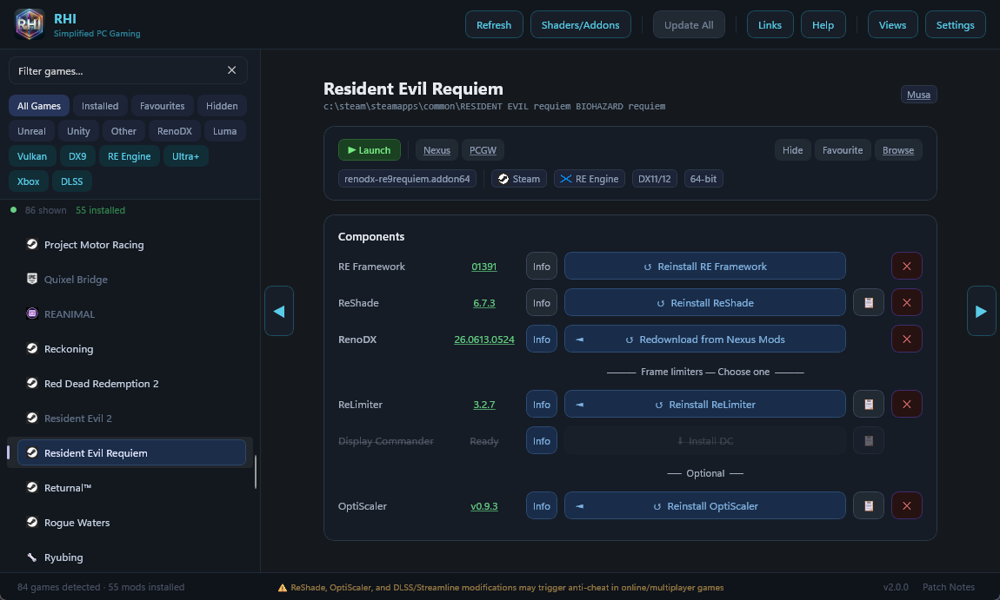

# RHI — Simplified PC Gaming

One app to manage HDR mods across your entire PC game library. RHI auto-detects games from eight storefronts, installs and updates ReShade, RenoDX, frame limiters, DLSS/Streamline, OptiScaler, and more — all with per-game control and zero manual configuration.

> **⚠ Single-player only.** RHI installs ReShade with addon support, which may trigger anti-cheat in online games. Uninstall before playing multiplayer.

---

## Why RHI?

- **8-store detection** — Steam, GOG, Epic, EA App, Ubisoft Connect, Xbox/Game Pass, Battle.net, Rockstar. No manual setup.
- **8 managed components** — ReShade, RenoDX, ReLimiter, Display Commander, OptiScaler, RE Framework, Luma Framework, DXVK. One-click install, update, and removal for each.
- **46 shader packs** — Essential, Recommended, and Extra categories. Global or per-game selection.
- **DLSS & Streamline management** — swap SR, Ray Reconstruction, and Frame Generation independently. Update or downgrade Streamline as a set. Per-game DLSS presets without NVIDIA Profile Inspector.
- **Nvidia Profile Overrides** — VSync, Low Latency, Smooth Motion, Power Mode, ReBAR, Multi Frame Generation, DLSS render scale (33–100%). All per-game, written directly to NVIDIA driver profiles.
- **Batch deploy** — update DLSS/Streamline versions and presets across multiple games at once.
- **DLSS & Streamline Defaults** — configure preferred versions, presets, and render scales. One-click Quick Apply per game.
- **Profile Export/Import** — back up all per-game NVIDIA profile settings to JSON. Restore after driver updates.
- **Drag-and-drop** — drop an exe, addon, preset, Luma archive, or URL. RHI figures out what to do.
- **Three view modes** — Detail View, Grid View, Simple View. Fresh installs default to Simple View.
- **Game Launch** — Steam uses `-applaunch` (with overlay and playtime tracking), Epic uses its protocol, everything else launches directly. Custom exe and arguments per game.
- **Luma + RenoDX coexistence** — for compatible games, both frameworks run side by side.
- **Ryubing emulator support** — 9 Switch game addons from Souperman9, downloaded and deployed in one click. Addons self-select which game is running.
- **UE-Extended auto-configuration** — reshade.ini `[renodx]` section and Engine.ini HDR settings are written automatically.
- **Nexus Mods update alerts** — GraphQL API, no API key required.
- **Remote manifest** — game-specific fixes pushed over the air without app updates.
- **Foreign DLL protection** — binary signature scanning prevents accidental overwrites of DXVK, Special K, ENB, etc.
- **Addon file watcher** — auto-detects new addons in your Downloads folder and prompts to install.
- **Message of the Day** — important notices delivered on launch when something changes.

---

## Managed Components

| Component | What it does |
|-----------|-------------|
| [ReShade](https://reshade.me) | Post-processing injection framework. Channels: Stable, Nightly, Custom (user DLLs), Legacy (pin to 6.0.0+), No Addons. |
| [RenoDX](https://github.com/clshortfuse/renodx) | HDR mod framework. Game-specific mods matched from the RenoDX wiki with generic Unreal/Unity/UE-Extended fallbacks. |
| [ReLimiter](https://github.com/RankFTW/ReLimiter) | Frame pacing addon with configurable OSD hotkey and shared presets. |
| [Display Commander](https://github.com/pmnoxx/display-commander) | Alternative frame rate limiter. Mutually exclusive with ReLimiter. |
| [OptiScaler](https://github.com/optiscaler/OptiScaler) | Upscaler redirection (DLSS ↔ FSR ↔ XeSS). Auto-downloads DLSS DLLs, handles ReShade coexistence, includes OptiPatcher for AMD/Intel. |
| [RE Framework](https://github.com/praydog/REFramework-nightly) | Required for ReShade on RE Engine games (Monster Hunter Wilds, Resident Evil, DMC5, SF6, etc.). |
| [Luma Framework](https://github.com/Filoppi/Luma-Framework) | DX11 HDR modding framework. Toggle per game — ReShade and RenoDX are swapped automatically. |
| [DXVK](https://github.com/doitsujin/dxvk) | DirectX-to-Vulkan translation for DX8–DX10 games. Variants: Development, Stable, Lilium HDR (scRGB output). Per-game selection. |

---

## Key Features

### DLSS & Streamline

- Swap DLSS SR, Ray Reconstruction, and Frame Generation to any version independently
- Update or downgrade Streamline as a complete set
- DLSS presets per game — SR: Default/J/K/L/M · RR: Default/D/E · FG: Default/A/B
- DLSS render scale override: 33–100% per game for both SR and RR
- Multi Frame Generation (RTX 50 Series): Mode (Default/Fixed/Dynamic), Frame Count (2x–6x), Target FPS
- Quick Apply deploys your configured defaults to any game in one click
- Batch Deploy updates versions + presets across multiple games simultaneously
- Backup/restore per game (`.original` files)

### Nvidia Profile Overrides

All per-game via NVIDIA driver profiles. Requires admin (Task Scheduler-based persistent elevation available).

- **VSync** — Mode + Tear Control
- **Low Latency** — Off / On / Ultra
- **Smooth Motion** — Enable + APIs + Flip Pacing
- **Power Mode** — Adaptive / Prefer Max Performance / Optimal
- **ReBAR** — Enable / Mode / Size Limit
- **Profile Export/Import** — back up all settings to JSON, restore after driver updates

### Global Nvidia Settings (Settings page)

- Shader Cache Size
- Shader Pre-Compile
- G-Sync Mode
- Preferred Refresh Rate
- Global ReBAR (On/Off + Size)
- DLSS On-Screen Indicator

### Admin Mode

Task Scheduler-based persistent elevation. Toggle Off/On in Settings. When enabled, RHI silently relaunches elevated on startup — no per-operation UAC prompts. Required for ReBAR, Low Latency (ULL), Smooth Motion, and CPU Scheduling writes.

### Per-Game Overrides

DLL naming · Shader mode (Global/Custom/Select/Off) · Addon mode (Global/Select/Off) · Bitness · Graphics API · ReShade channel (Stable/Nightly/Custom/Legacy/No Addons) · DXVK variant · Launch exe + arguments · Update inclusion toggles · Wiki name mapping

### OptiScaler

Upscaler redirection with automatic DLSS DLL downloads, ReShade coexistence, INI configuration, and OptiPatcher for AMD/Intel GPUs.

### HDR Gaming Database

The RenoDX Info button links directly to HDR Gaming Database entries for supported games.

### UW Fix & Ultra+ Links

Quick links to ultrawide fixes (Lyall, RoseTheFlower, p1xel8ted) and Ultra+ mods appear on game cards when available.

---

## Quick Start

1. **Download and run RHI** — your game library appears automatically.
2. **Pick a game** from the sidebar. Search or use filter chips to narrow the list.
3. **Click Install** on the components you want — ReShade, RenoDX, a frame limiter.
4. **Launch the game**, press **Home** to open ReShade, go to **Add-ons**, and configure RenoDX.

---

## Download

Grab the latest release from the [GitHub Releases page](https://github.com/RankFTW/RHI/releases).

**Requirements:**
- Windows 10/11 (x64)
- [.NET 8 Desktop Runtime](https://dotnet.microsoft.com/download/dotnet/8.0)
- NVIDIA GPU recommended for DLSS/Streamline and Profile Override features (AMD/Intel supported for everything else)

---

## Troubleshooting

| Problem | Fix |
|---------|-----|
| Game not detected | **Add Game** in Settings — pick the game's exe and name it |
| Xbox games missing | Click **Refresh** — Game Pass detection may need a moment |
| ReShade not loading | Check the install path via 📁 — the DLL must sit next to the game exe |
| Black screen (Unreal) | ReShade → Add-ons → RenoDX → set `R10G10B10A2_UNORM` to `output size` |
| UE-Extended not working | Enable HDR in the game's display settings first |
| Downloads failing | Click **Refresh**, or clear cache from Settings → Open Downloads Cache |
| DLSS presets not applying | Enable Admin Mode in Settings, or run RHI as administrator |
| Everything out of sync | Settings → **Full Refresh** clears all caches and re-scans |

For the full reference covering every feature, see the [Detailed Guide](docs/DETAILED_GUIDE.md).

---

## Third-Party Components

| Component | Author | Licence |
|-----------|--------|---------|
| [ReShade](https://reshade.me) | Crosire | [BSD 3-Clause](https://github.com/crosire/reshade/blob/main/LICENSE.md) |
| [RenoDX](https://github.com/clshortfuse/renodx) | clshortfuse & contributors | [MIT](https://github.com/clshortfuse/renodx/blob/main/LICENSE) |
| [ReLimiter](https://github.com/RankFTW/ReLimiter) | RankFTW | Source-available |
| [Display Commander](https://github.com/pmnoxx/display-commander) | pmnoxx | [GPL-3](https://github.com/pmnoxx/display-commander/blob/main/LICENSE) |
| [RE Framework](https://github.com/praydog/REFramework-nightly) | praydog | [MIT](https://github.com/praydog/REFramework/blob/master/LICENSE) |
| [Luma Framework](https://github.com/Filoppi/Luma-Framework) | Pumbo (Filoppi) | Source-available |
| [OptiScaler](https://github.com/optiscaler/OptiScaler) | OptiScaler contributors | Source-available |
| [DXVK](https://github.com/doitsujin/dxvk) | doitsujin & contributors | [Zlib](https://github.com/doitsujin/dxvk/blob/master/LICENSE) |
| [DXVK HDR-mod](https://github.com/EndlesslyFlowering/dxvk) | EndlesslyFlowering (Lilium) | [Zlib](https://github.com/EndlesslyFlowering/dxvk/blob/HDR-mod/LICENSE) |
| [7-Zip](https://www.7-zip.org/) | Igor Pavlov | [LGPL-2.1 / BSD-3-Clause](https://www.7-zip.org/license.txt) |

> RHI is an unofficial third-party tool, not affiliated with or endorsed by the RenoDX project, Crosire, or the Luma Framework. All mod files are downloaded from their official sources at runtime and are not redistributed.

---

## Acknowledgements

RHI would not be possible without the hard work of the entire RenoDX team and [Crosire](https://reshade.me), the creator of ReShade. Thank you to every mod author, contributor, and tester who keeps pushing PC HDR forward.

---

## Links

[RenoDX](https://github.com/clshortfuse/renodx) · [RenoDX Wiki](https://github.com/clshortfuse/renodx/wiki/Mods) · [ReShade](https://reshade.me) · [Luma Framework](https://github.com/Filoppi/Luma-Framework) · [Luma Mods List](https://github.com/Filoppi/Luma-Framework/wiki/Mods-List) · [ReLimiter](https://github.com/RankFTW/ReLimiter) · [HDR Guides](https://www.hdrmods.com)

[RenoDX Discord](https://discord.gg/gF4GRJWZ2A) · [HDR Den Discord](https://discord.gg/k3cDruEQ) · [RHI Support](https://discordapp.com/channels/1296187754979528747/1475173660686815374) · [Ultra+ Discord](https://discord.gg/pQtPYcdE)

[Support RHI on Ko-Fi ☕](https://ko-fi.com/rankftw)
